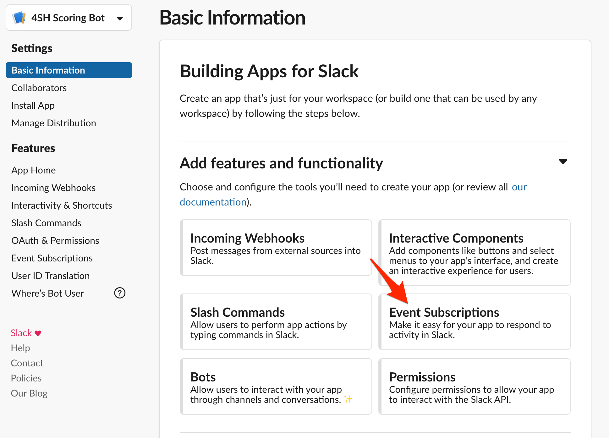

# <h1 align="center">Welcome to GoogleAppScript's Advent of Code Bot 👋</h1>
> A Google App Script-based bot to manage advent-of-code Slack interactions

Features
----------

Currently, bots allows to :

- Display leaderboard through the `!leaderboard` command
  
- Be notified in the morning when a new puzzle appears
  
- Be notified when some members are earning some points
  

Installation instructions
----------

Don't be afraid by the long guidelines, I tried to be as detailed as possible.

Overall, it should take you up to 10min to setup everything.

### Installation pre-requisites

- `npm@3+`
- A Google account
- Being administrator of your Slack channel (or knowing the admin as you will have to register the bot on it)
- This repository being cloned somewhere on your filesystem 

### Slack Bot Deployment

- `cd` to `advent-of-code-slack-bot/` directory then run `npm install` on it
- Authenticate with `clasp` (google app script CLI) with `npx clasp login` (follow instructions)  
  Note: `clasp` is a CLI to manage your Google App Scripts, and it's powered by Google (more infos [here](https://codelabs.developers.google.com/codelabs/clasp/))
- Enable app script API here : https://script.google.com/home/usersettings
- Run `npx clasp create --type api` : a new google app script should be created under your google account.
  Publish keys for this script are going to be set into a `.clasp.json` private file : ⚠️ don't commit this file otherwise
  people will have access to your script !
- Run `npx clasp push` (or `npx clasp push --watch` if you want to edit/auto-deploy some changes made to the script)
  - `Manifest file has been updated. Do you want to push and overwrite?` => Answer "Yes" here
    Files are going to be compiled and pushed into your Google App Script.
- Run `npx clasp deploy` : a new version of your API is going to be made available on the internet
- Open your app script by running `npx clasp open`
  - Once opened, click on the "play" button in order to try to execute doPost function
  - By executing this, you should have an `Authorization required` popup : examine and grant authorizations to your current google account
    Note that if you get a "This application has not been validated (yet) by Google" error, click on `Advanced parameters`
    and proceed to the page (unsecure content)
  - There may have some errors executing doPost : don't worry that's expected (purpose was only to grant authorization to your user)
  - Open the `Publish > Deploy as web app` menu
  - In the popup, copy `Current Web app` URL : this is going to be your HTTP entrypoint for the Bot  
    ⚠️ Avoid sharing this URL too widely, as anyone having access to this URL will be able to control the Bot and cheat :-)
  - Open `File > Project Properties` and select the `Script Properties` tab then create following properties / values :

  | Property name | Value | Meaning |
  |---------------|-------|---------|
  | LOG_ENABLED | true | This can be helpful to see logs, particularly at the beginning |
  | SLACK_CHALLENGE_ACTIVATED | true | Put this to true in order to allow Slack bot challenge |
  | ADVENT_OF_CODE_PRIVATE_LEADERBOARD_CODE | _a number_ | Use your advent of code private leaderboard code (integer) here. You can simply get here in the URL when you navigate to https://adventofcode.com/2020/leaderboard/private/view/xxxxx (the code corresponds to `xxxxx`) |
  | ADVENT_OF_CODE_SESSION_COOKIE | _a string_ | Introspect queries made to advent of code to extract your session cookie value (in headers) and put it here |

### Slack instance configuration

- As a Slack administrator, open your Slack App page [here](https://api.slack.com/apps)
- Click on `Create New App` button to create a new Application
  
- Fill App Creation popup and reference the Slack Workspace
  
- Once done, and from `Basic Information` screen, open the `Event subscriptions` configuration page
  
- Activate events and paster Google App Script's Slack Bot URL you copied previously :
  
  - Wait for Google App Script challenge verification : if there is a failure, review Google App Script's `SLACK_CHALLENGE_ACTIVATED` project property
   to ensure this is valued to `true` and verify that GAS execution authorization has been granted.
  - Declare 1 `bot events` described in screenshot above : `message.channels`
  - Don't forget to save changes
- Once done, navigate to `OAuth & Permissions` section  
  
  - In `Scopes` section, there should already be `channels:history` ; Add `channels:join` and `chat:write`
    
  - Once done, click on `Install App to Workspace` button on top of the screen, and validate permissions configured previously
    
  - Copy generated `Bot User OAuth Access Token` ...
    
  - ... and paste it into Google App Script's `SLACK_ACCESS_TOKEN` Project Properties. At the same time, disable `SLACK_CHALLENGE_ACTIVATED` flag.
    

### Spreadsheet config & DB creation

- Move to the `advent-of-code-sheet/` directory then run `npm install` on it
- Run `npx clasp create --type sheets` : a new google spreadsheet & app script should be created under your google account.
  - Copy generated google spreadsheet id ...
    
  - ... and paste it into the GAS `SPREADSHEET_ID` project property
    
  - Open Google spreadsheet based on the created URL : this will be useful in next steps as we're going to fill this spreadsheet
    with some data.
- Run `npx clasp push` (or `npx clasp push --watch` if you want to edit/auto-deploy some changes made to the script)
  - `Manifest file has been updated. Do you want to push and overwrite?` => Answer "Yes" here
    Files are going to be compiled and pushed into your Google App Script.
- In the spreadsheet, put following formula in a cell : `=SAY_HELLO()` : this will call code defined into your `main/index.ts`
  typescript file and can be useful if you would have to generate complex data into your spreadsheet.

### Slack channel

- Open Slack and invite the bot into one of your channels (prefer to choose a testing channel to begin with) : `/invite @<bot_name>`
- Channel help can be displayed by saying `!help`
- You can also try to show your leaderboard to check if everything is good by writing `!leaderboard`

### CRON configuration

To be able to show daily puzzles and new score earnings, you will need to configure some external CRONs to trigger the bot at certain points in time.

You have several options :
- Either find a CRON as a Service app in the cloud (for example : [Google Cloud Scheduler](https://console.cloud.google.com/cloudscheduler))
- Setup a CRON job on a server somewhere

Those calls will trigger some computation on the Bot which may imply some message being pushed on a Slack channel.
To provide this Slack channel, you need to gather its ID :
- Open the Google Sheet (the one that has been created in previous step)
- Open the "Logs" tab in the spreadsheet
- You should see some messages in the log, showing the channel id. Something like `Help requested in channel XXXXXX`, here it is your channel id. 

CRONs have to be configured that way :

  | When          | URL to call | Payload |
  |---------------|-------------|---------|
  | `*/15 * * * *` _(every 15min, as advised by Eric Wastl)_ | Your Google App Script URL (the one you get through `Publish > Deploy as web app` menu) | `{"action":"refreshLeaderboard","channelId":"xxxxxx"}`, fill the `channelId` properly |
  | `4 5 * * *` _(once a day at 05:04 AM, UTC Time)_ **Important: if your CRON is using another timezone, don't forget to shift time based on it** | Your Google App Script URL (the one you get through `Publish > Deploy as web app` menu) | `{"action":"publishNewPuzzle","channelId":"xxxxxx"}`, fill the `channelId` properly |

The first time 15min CRON will be triggered, the bot is supposed to post a message into the Slack channel to welcome every members of the board.
This will be a proof that everything has been setup properly.

Credits
----------

Thanks to Eric Wastl for his marvelous Advent of code idea :)
